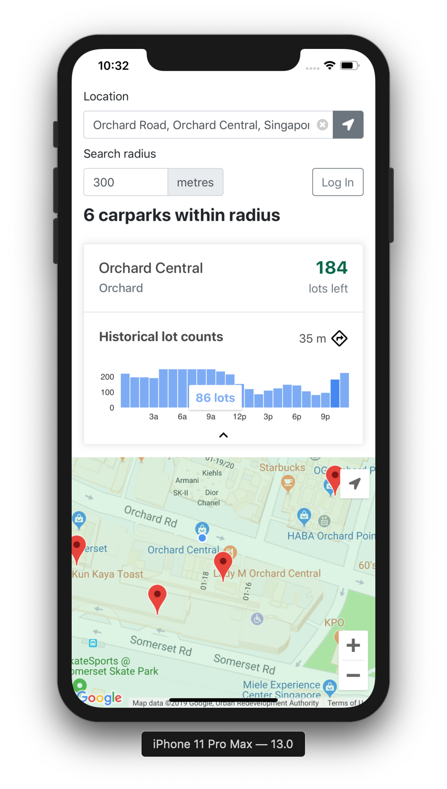
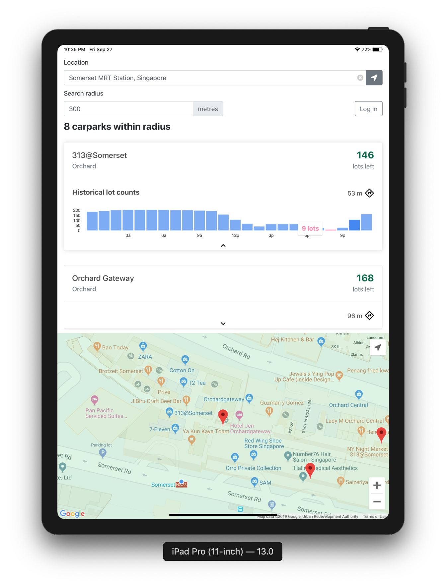
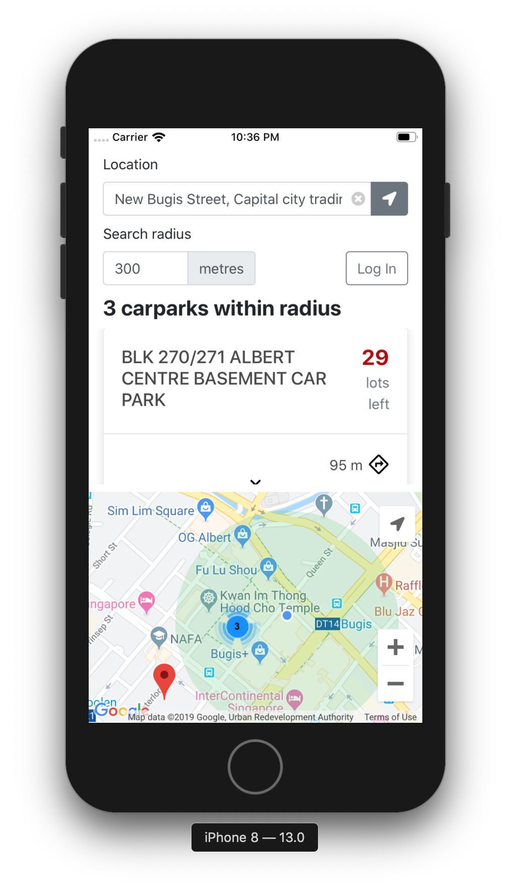

  

Having trouble find carparks in Singapore? Carina is a mobile cloud 
application to help you find the nearest carpark anywhere and anytime. 
It can even recommends the best carpark based at your current location.

* View the number of available slots at any carpark per hour
* Find nearest carparks at your current location or at any other regions
* Recommend the best carpark by number of available slots and proximity
* Save your favourite carpark to search again easily

  
  
  

  Try our application or find the nearest carpark now at https://carina-parking.netlify.com/

Team Members
* Lau Kar Rui (A0155936U): 
  - Designer: ui/ux
  - Frontend: maps, search, styling, histogram, pwa icon and splash screen integration
  - Devops: front-end hosting, preprocessing
* Jeremy Tan Kai Qun (A0136134N): 
  - Frontend: auth, favourite, offline, integration
* Ng Wei Jie, Brandon (A0184893L):
  - Backend: restful api, swagger docs, database, migration scripts
  - Devops: back-end hosting, testing
